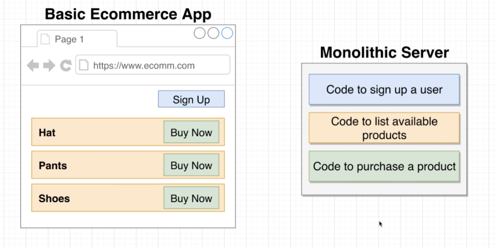

# Study case: "mini" e-commerce app

## What are monolithic applications
A monolithic application is self-contained and independent from other computing applications. The design philosophy is that the application is responsible not just for a particular task, but can perform every step needed to complete a particular function

## What are microservices applications
Microservices or microservice architecture, is an architectural style that structures an application as a collection of services.

# Advantages of using microservices

1. Easier to Build and Maintain Apps
2. Organized Around Business Capabilities
3. Improved Productivity and Speed
4. Flexibility in Using Technologies and Scalability
5. Autonomous, Cross-functional Teams

# Biggest challenge with microservices

The microservice architecture is not a silver bullet. It has several drawbacks. Moreover, when using this architecture there are numerous issues that you must address. 

- Data management between services

Since each service communicates with its own database and cannot access directly another services database,
the **biggest** problem is finding an efficient mannter of sharing the data between these services.
